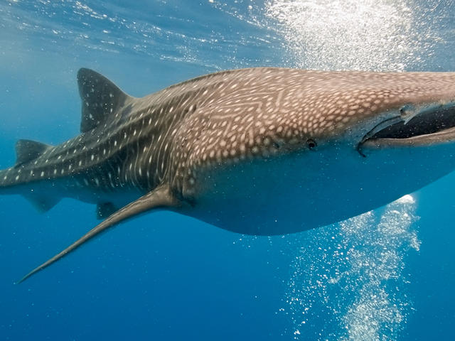
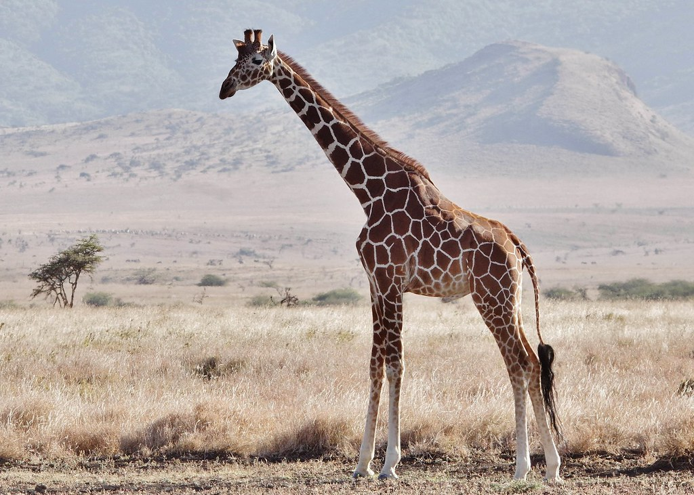
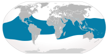
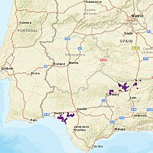
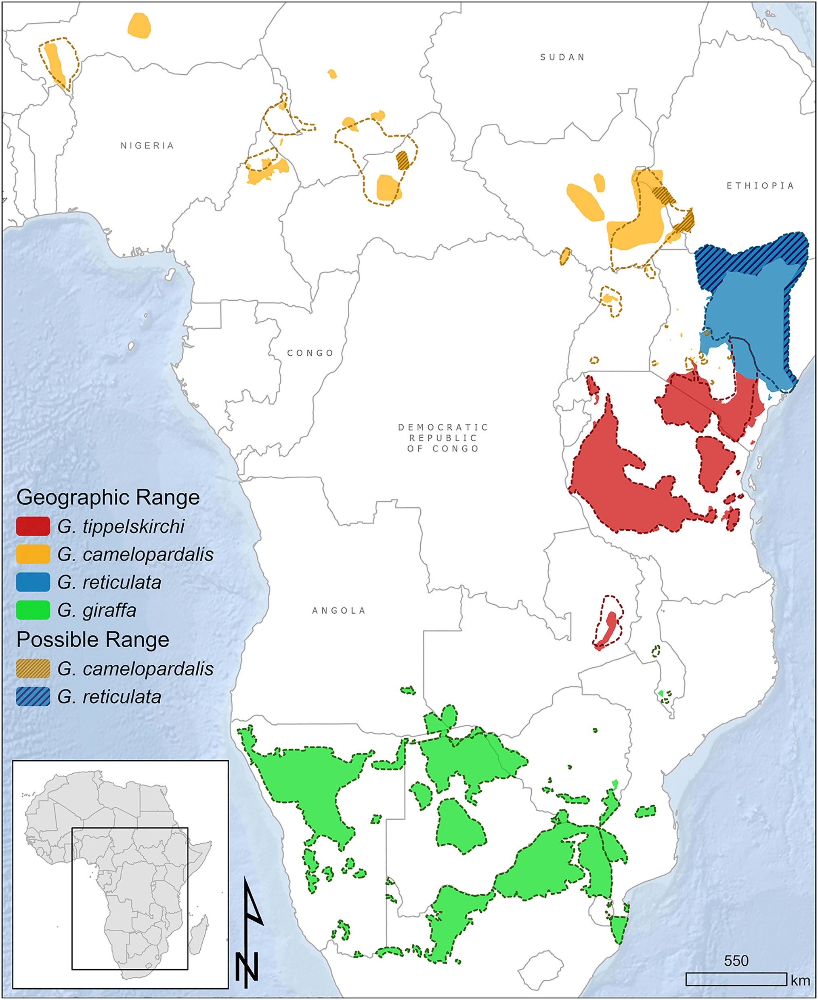
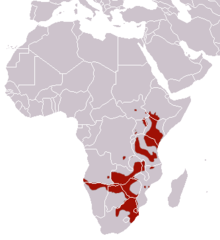
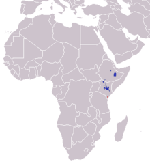

# Wildbook Social Media Bias Research #

This repository contains classes to work with Youtube, Twitter, Flickr and iNaturalist APIs inorder to collect data
to help monitor wildlife populations. In using this data, it is important to analyze any potential biases
behind the data collect by gaining insight on the user base. 

In this repository you will find the following:

**playground** folder contains code to query our database, manually filter our data, and display analytics for each platform on the data filtered so far. Each social media platform (YouTube, Flickr, iNaturalist, and Twitter) has their own playground. Additionally, you will find within this folder a **Database** playground, which is used to generate analytics for species across each platform and compare effectively. 

**wildbook-social** folder contains the scripts responsible for loading the api and collecting data. Within this folder you will find a folder for each platform and their respective API endpoint queries, as well as an additional **Database** folder. This **Database** folder contains the script responsible for handling operations dealing with species collections in MongoDB.

Analytics collected so far include:
  *user-encounter location maps
  *posts per week (with and without a moving avg filter)
  *distribution of difference in user-encounter location distances 
  *time delay between successive posts
  
Currently, our queries are focused around six species: humpback whales, whale sharks, iberian lynx, reticulated giraffe, plains zebras and grevys zebras. 
This array of species offers a combination of terrestial and marine animals, as well as migratory and habitat-specific species. The combination is helpful in understanding and forming conclusions behind biases of the user base per platform.

  
  

# Key-Findings #
All data analyzed was data that was uploaded in the time frame of June 2019 - September 2020

## Overlapping Geographical Ranges

Among the data collected across all four social media platforms (YouTube, Flickr, iNaturalist, Twitter), we were able to find that data source geographical ranges were consistent with those of habitats belonging to each species. 

In the following figures, we show the known habitats of all six species, as well as the plotted encounter and user locations collected from our data. Note: the iNaturalist platform in particular posed a greater challenge in collecting user location information due to privacy restrictions. Plots for iNaturalist map encounter location only. 

### Known Ranges ###
Known ranges in order of left to right, top to bottom: humpback whales, whale sharks, iberian lynx, reticulated giraffe, plains zebra, grevy's zebra
(sources: Wikipedia and WWF)

  
  

In the following data plots, red dots signify encounter locations while green dots signify residing location of the user. All figures are consistent in ordering (left to right, top to bottom: humpback whales, whale sharks, iberian lynx, reticulated giraffe, plains zebra, grevy's zebra)

#### YouTube ####

  
  
  
 ## Seasonal Patterns 
 In understanding the upload rate per platform, we plotted the number of posts per week per species from June 2019 - September 2020. 
 Our findings converged on the idea that time spans with the highest volume per species were consistent with seasonal patterns species exhibit (e.g mating season, year-round migration). It is also notable that tourism and interactive events serve as a key-propeller in data generation, with high volumes of posts being uploaded during time spans typically associated with vacation seasons(e.g summer months - May to August, winter months - December to January).
 
 <insert plots here>
 
 ## iNaturalist - Delay in Upload Time from Time of Encounter
 An example of underlying bias in our data collected is evident when visualizing the delay in time between when a post is uploaded onto the iNaturalist platform and when the encounter actually occured. iNaturalist, unlike the other platforms, provides data for each post on when the encounter actually occured, and when the post documenting the encounter was posted. Below, we visualisze the time difference for each post that documents an encounter in our June 2019-Sep 2020 timeline. 
 
 <insert plots here>
 
 <insert time difference histograms here>
 
 Our data shows that time delays vary greatly, with some users posting up to 300 days after the date of the encounter. Looking at the histograms mapping the frequency of time delays, we observe that there is an exponential decay in delay, meaning that although most users upload the day of the encounter or very soon after, there are still cases in which users upload their enconters with a greater delay. These larger delays have lower frequencies. We speculate that large delays in posting times may be attributed to a more recent upload triggering past media to be uploaded, essentially resulting in the user uploading all viable data they have all in one go.
 
 ## Concluding Remarks
 Our data shows that social media platforms are a viable method of collecting data for wildlife population monitoring. A more extensive analysis with additional analytical methods was conducted to the information shown here. With that said, we are currently in the process of writing up the publication explaining key factors of bias we discovered throughout the data collection process, as well as forming a more in-depth analysis on the significance of ease-of-access each platform provides, and how this impacts what the data collected through social media provides. A link to the publication will be provided once it is available. :)
